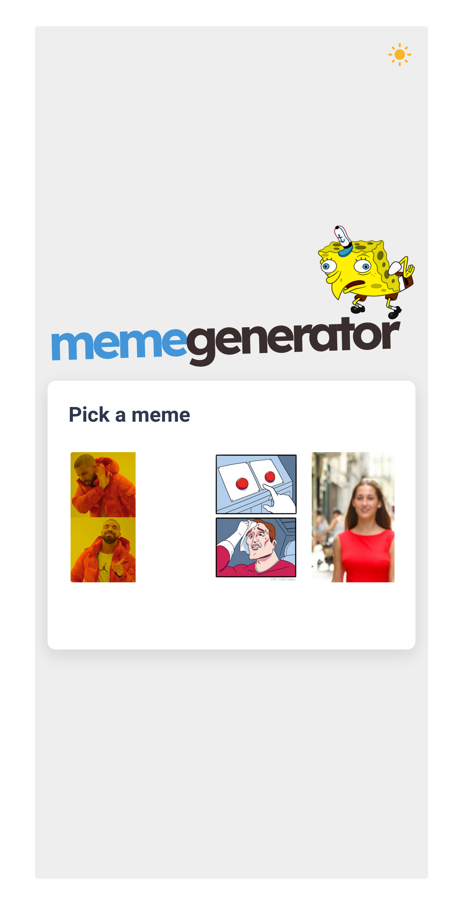

<p align="center">
  
</p>

<p align="center">
 Know your meme generator. 
</p>

## Screenshots

<p float="center">
  
  
  
</p>

## Run Locally

Ensure you have [Yarn](https://classic.yarnpkg.com/lang/en/docs/install/#mac-stable) installed.

Clone the project:

```bash
git clone https://github.com/fariasmateuss/meme-generator.git
```

Go to the project directory:

```bash
cd meme-generator
```

Add a .env.local file, make a [imgflip](https://imgflip.com/) account and add its key following .env.example file:

```bash
mv .env.example .env.local
```

Install dependencies:

```bash
yarn
```

Start the server:

```bash
yarn dev
```

_or_

```bash
yarn next
```

Open [http://localhost:3000](http://localhost:3000) with your browser to see the result.

## Deployment

To deploy this project run:

```bash
yarn build
```

## Feedback

If you have any ideas or feedback for this project, please let me know. Connect with me on [Twitter](https://twitter.com/fariasmateuss) or [LinkedIn](https://www.linkedin.com/in/fariasmateuss/).

## Contributing

If you found this useful, please help us improve it by contributing.

See [contributing](/docs/CONTRIBUTING.md) for more details.

# License

Released under the [MIT License](/LICENSE)

Made with :hearts: by Mateus V. Farias
